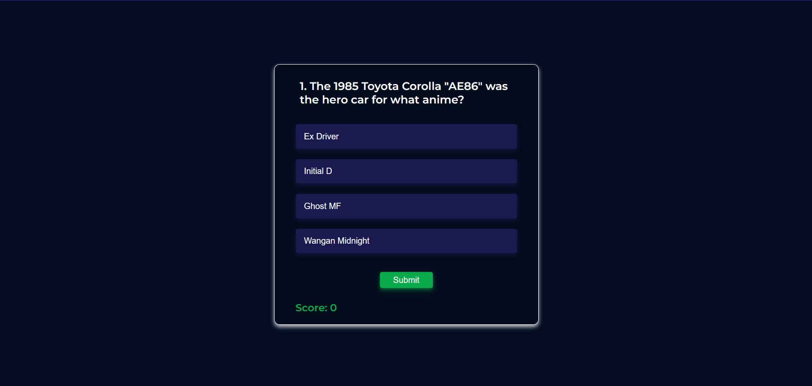

# 🎯 Trivia Quiz App

A beginner-friendly quiz application built with **HTML**, **CSS**, and **JavaScript**, using the **Open Trivia API** to fetch live quiz questions dynamically.

## 🌐 Live Demo

[Click here to try the app](link)  

---

## ✨ Features

- 🔄 Fetches real-time questions using [Open Trivia API](https://opentdb.com/)
- 🎲 Shuffles answer options randomly each time
- 🧠 Displays one question at a time with 4 options
- ✅ Tracks and displays score after quiz submission
- 📱 Responsive UI

---

## 📸 Preview

